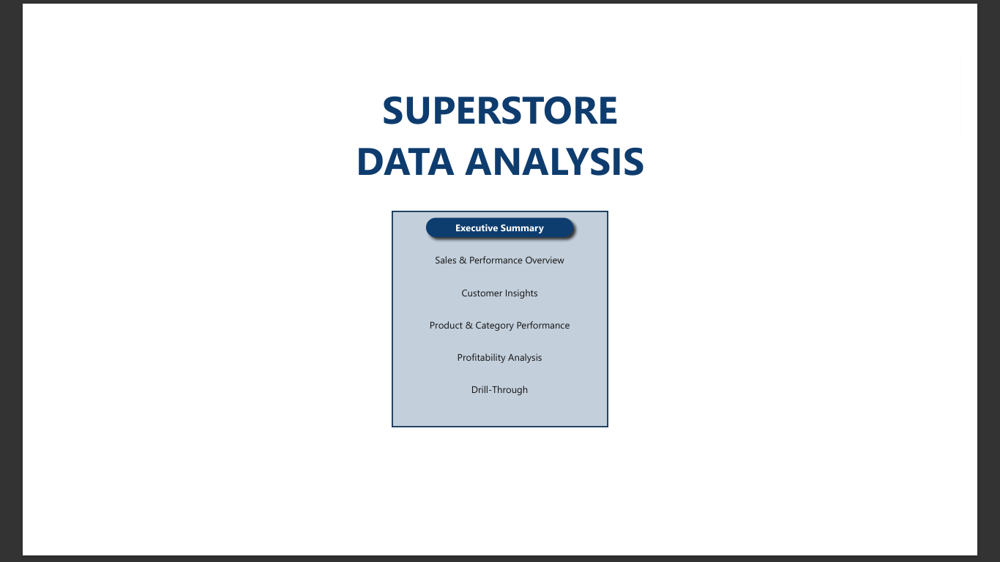
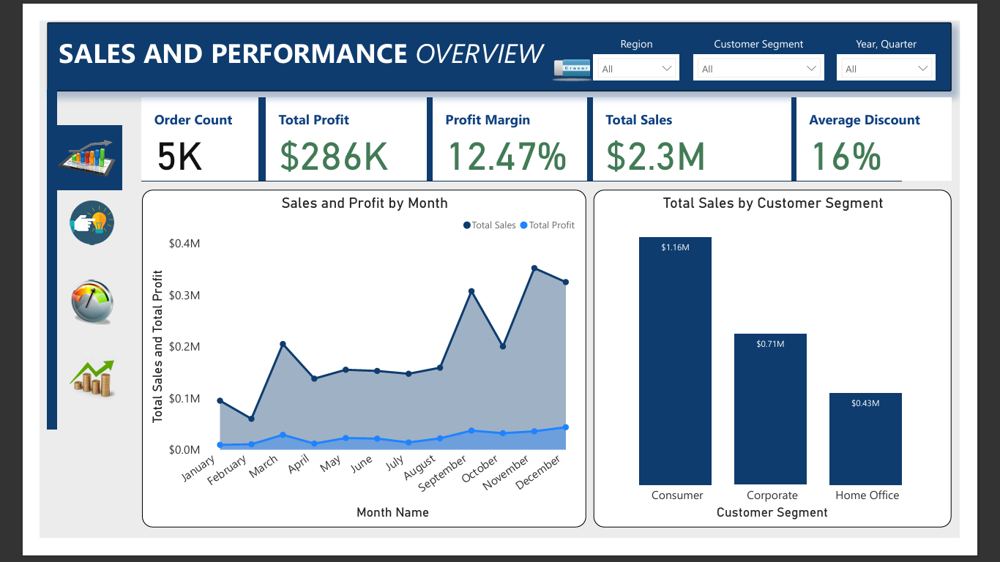
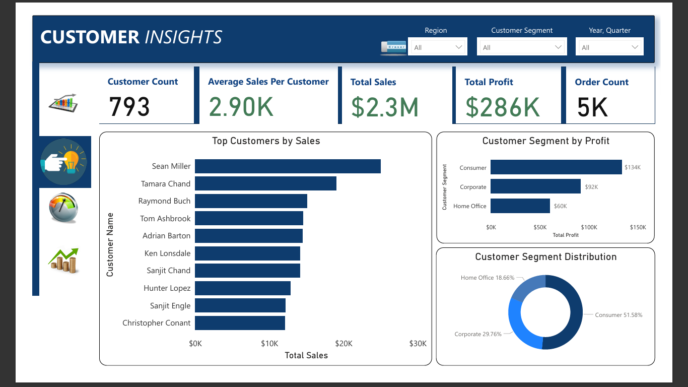
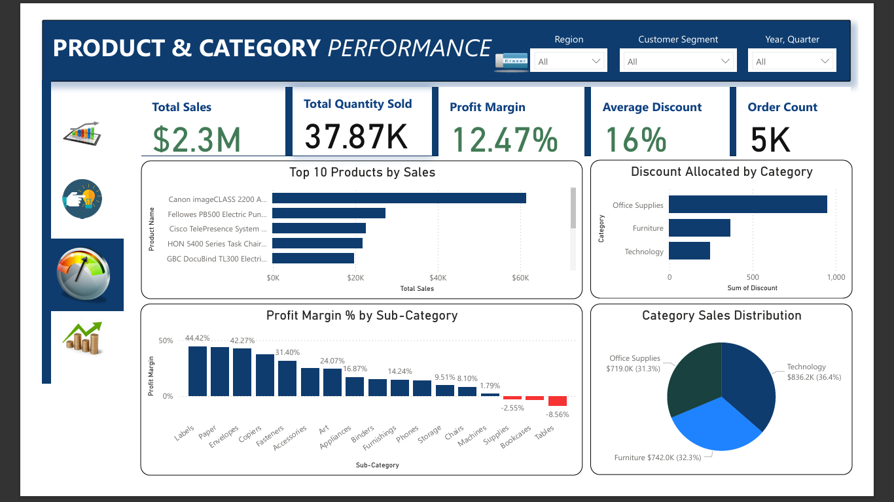
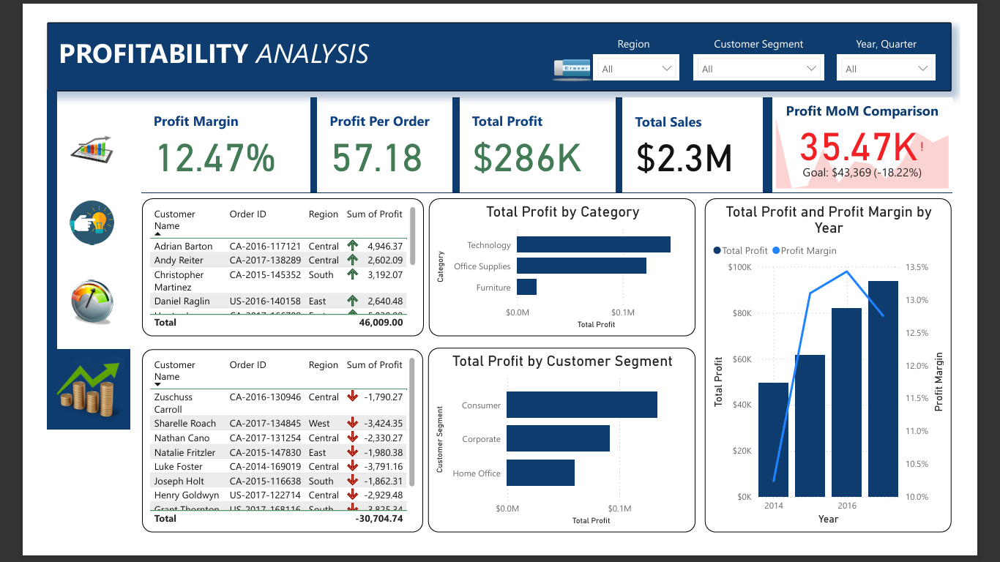

🛒 Superstore Sales Dashboard — Data Analysis
> *Technology leads in sales, but Tables and Bookcases are quietly draining profit.*
A 6-page Power BI dashboard built to analyse retail sales performance, customer behaviour, product profitability, and revenue trends across a superstore dataset — helping business leaders make smarter stocking, pricing, and customer strategy decisions.
---
📌 Project Overview
Retail businesses generate enormous volumes of transactional data, but without proper analysis, critical patterns go unnoticed — underperforming products remain on shelves, high-value customers go unrecognised, and discount strategies erode margins silently. This dashboard transforms raw Superstore sales data into a clear, interactive story across six focused pages, enabling decision-makers to act on what the numbers actually say.
---
🎯 Objective
To design a comprehensive, interactive Power BI dashboard that enables retail business stakeholders to:
Monitor overall sales and profitability performance at a glance
Understand which customer segments, products, and regions drive the most value
Identify which sub-categories and products are loss-making despite high sales volumes
Track profit margin trends over time and benchmark against monthly goals
Drill through individual customer orders for granular profit investigation
---
❓ Problem Statement
The Superstore was generating $2.3M in total sales but only achieving a 12.47% profit margin — well below what a healthy retail operation should yield. Key questions the business needed answered:
Which product categories and sub-categories are profitable, and which are destroying value?
Who are the highest-value customers, and which segments drive the most revenue?
Are discount strategies helping sales volume at the cost of profitability?
How has profit margin trended year-on-year, and is the business improving?
Which individual orders or customers are generating the biggest losses?
This dashboard was built to answer all five questions in one unified view.
---
🏆 Goals
Build a fully interactive dashboard with cross-filtering slicers for Region, Customer Segment, and Year/Quarter
Surface the top and bottom performing products, sub-categories, and customers by profit
Create a dedicated Profitability Analysis page that flags both top profit contributors and loss-making orders
Include Month-on-Month (MoM) sales and profit comparisons with goal benchmarks
Deliver a Drill-Through page enabling users to investigate individual customer orders in detail
---
🖼️ Dashboard Preview
Cover Page

Page 1 — Sales & Performance Overview

Page 2 — Customer Insights

Page 3 — Product & Category Performance

Page 4 — Profitability Analysis

Page 5 — Summary (MoM & Trend)

Page 6 — Drill-Through

---
🔢 Key Metrics at a Glance
Metric	Value
Total Sales	$2.3M
Total Profit	$286K
Profit Margin	12.47%
Order Count	5K
Average Discount	16%
Total Quantity Sold	37.87K
Customer Count	793
Average Sales Per Customer	$2.90K
Profit Per Order	$57.18
Sales MoM	$325,293.5 (Goal: $352.46K, -7.71%)
Profit MoM	$35.47K (Goal: $43,369, -18.22%)
---
📋 Dashboard Pages & Insights
Page 1 — Sales & Performance Overview
A high-level snapshot of total business performance with monthly trend analysis.
Total sales of $2.3M across 5,000 orders with an average discount of 16%
Sales and profit trend by month: Sales peak in November and December, reflecting seasonal buying behaviour. Profit remains relatively flat throughout the year despite sales spikes — suggesting high discounting during peak periods
Sales by customer segment: Consumer segment dominates at $1.16M (50.4%), followed by Corporate at $0.71M (30.9%) and Home Office at $0.43M (18.7%)
Slicers: Region, Customer Segment, and Year/Quarter — all cross-filtering simultaneously across the page
---
Page 2 — Customer Insights
Focuses on who is buying, how much they spend, and which segments drive the most profit.
793 unique customers with an average sales value of $2.90K per customer
Top customer by sales: Sean Miller leads significantly, followed by Tamara Chand, Raymond Buch, Tom Ashbrook, and Adrian Barton — the top 10 customers represent a disproportionate share of total revenue
Customer segment by profit:
Consumer: $134K (46.9% of total profit)
Corporate: $92K (32.2%)
Home Office: $60K (21%)
Segment distribution: Consumer accounts for 51.58% of the customer base, Corporate 29.76%, and Home Office 18.66%
Key insight: Despite being the smallest segment by customer count, Home Office customers generate proportionally strong profit relative to their size — worth nurturing with targeted campaigns
---
Page 3 — Product & Category Performance
Breaks down which products and categories are earning their place — and which are not.
Top product by sales: Canon imageCLASS 2200 Advance Copier leads at approximately $60K in sales, followed by Fellowes PB500 Electric Punch and Cisco TelePresence System
Category sales distribution:
Technology: $836.2K (36.4%)
Furniture: $742.0K (32.3%)
Office Supplies: $719.0K (31.3%)
Profit margin by sub-category — the most critical visual on this page:
Labels (44.42%) and Paper (42.27%) are the most profitable sub-categories
Copiers (31.40%) and Envelopes (24.07%) also perform well
Bookcases (-2.55%) and Tables (-8.56%) are loss-making — negative profit margins despite generating sales volume
Discount by category: Office Supplies receives the highest total discount allocation, followed by Furniture and Technology — partly explaining the margin compression in Furniture sub-categories
Key insight: Tables and Bookcases are destroying value. Either pricing needs to increase, discounts need to be eliminated, or these products need to be deprioritised
---
Page 4 — Profitability Analysis
The most actionable page — identifies both top profit contributors and the worst loss-making orders.
Profit margin: 12.47% | Profit per order: $57.18 | Profit MoM vs. goal: -18.22%
Total profit by category:
Technology generates the highest profit
Office Supplies is second
Furniture lags significantly — consistent with its loss-making sub-categories (Tables, Bookcases)
Total profit by customer segment: Consumer leads at the highest total profit, followed by Corporate and Home Office
Top profit-generating orders: Adrian Barton (CA-2016-117121, Central) leads with $4,946.37 profit; total top contributors sum to $46,009
Worst loss-making orders: Luke Foster (CA-2014-169019, Central) is the biggest loss at -$3,791.16; Sharelle Roach at -$3,424.35; total losses from worst orders sum to -$30,704.74
Profit margin trend by year:
2014: 10.23% → 2015: 13.10% → 2016: 13.43% → 2017: 12.74%
Margins improved significantly from 2014 to 2016, then dipped in 2017 — warranting investigation into 2017 discounting or product mix changes
Key insight: A small number of orders are responsible for disproportionate losses. Targeted review of high-discount, low-margin orders — particularly in Furniture — could recover significant profit
---
Page 5 — Executive Summary (MoM Trends)
A performance-at-a-glance page for senior stakeholders.
Sales MoM: $325,293.5 against a goal of $352.46K — 7.71% below target
Profit margin by year: Clear upward trajectory from 10.23% in 2014 to a peak of 13.43% in 2016, followed by a slight decline to 12.74% in 2017
Designed for quick executive consumption — headline figures with trend context
---
Page 6 — Drill-Through
An interactive drill-through page enabling users to click on any customer or segment in the dashboard and land on a granular view of their individual orders, regions, and profit contributions — supporting root cause analysis without leaving the report.
---
💡 Key Findings & Recommendations
1. 🔴 Tables and Bookcases have negative profit margins (-8.56% and -2.55%)
These sub-categories are actively losing money. Recommended action: eliminate or significantly reduce discounts on these items, review supplier pricing, or consider phasing them out of the product range.
2. 🔴 Loss-making orders total -$30,704.74
A concentrated set of orders — many in the Central region — are responsible for outsized losses. Recommended action: audit discount approval processes and introduce a floor margin policy for all orders.
3. 🟡 Profit MoM is 18.22% below goal
Monthly profit is consistently tracking below target. Recommended action: review the 16% average discount rate — even a 3–4% reduction could materially improve margin without significantly impacting volume.
4. 🟡 Profit margin declined from 13.43% in 2016 to 12.74% in 2017
After three years of improvement, 2017 saw a reversal. Recommended action: investigate 2017 product mix and discount patterns to identify what changed.
5. 🟢 Technology is the most profitable category
Despite not receiving the highest discounts, Technology generates the most profit. Recommended action: increase marketing investment and shelf space allocation toward Technology products.
6. 🟢 Consumer segment drives 46.9% of total profit
The Consumer segment is the most valuable. Recommended action: build loyalty programmes and personalised offers targeting the top 10 Consumer customers — they represent an outsized share of revenue.
7. 🟢 Home Office is an underserved high-value segment
Home Office customers are fewer in number but generate strong profit per customer. Recommended action: targeted B2C campaigns aimed at the home office buyer persona could unlock significant revenue growth.
---
🛠️ Tools & Technologies
Tool	Purpose
Power BI Desktop	Dashboard design, layout, and publishing
Power Query	Data cleaning, transformation, and shaping
DAX	Custom measures — profit margin %, MoM comparisons, profit per order, goal tracking
Superstore Dataset	Source retail transactional data
---
📁 Project Structure
```
superstore-sales-dashboard/
│
├── README.md
├── data/
│   ├── raw/
│   │   └── superstore_data.csv           # Original dataset
│   └── cleaned/
│       └── superstore_data_cleaned.csv   # Cleaned and transformed data
│
├── dashboard/
│   └── superstore_sales.pbix             # Power BI file
│
├── images/
│   ├── cover_page.png
│   ├── sales_performance_overview.png
│   ├── customer_insights.png
│   ├── product_category_performance.png
│   ├── profitability_analysis.png
│   ├── executive_summary.png
│   └── drill_through.png
│
└── docs/
    └── Superstore.pdf                    # Exported PDF version
```
---
🚀 How to Use
Clone or download this repository
Open `dashboard/superstore_sales.pbix` in Power BI Desktop
If prompted, update the data source path to point to `data/cleaned/superstore_data_cleaned.csv`
Use the dropdown slicers (Region, Customer Segment, Year/Quarter) to filter all visuals simultaneously
Navigate between pages using the left-hand navigation panel:
Cover Page → Sales & Performance Overview → Customer Insights → Product & Category Performance → Profitability Analysis → Executive Summary → Drill-Through
To use the Drill-Through page: right-click any customer name or data point on the Customer Insights page → select Drill Through → the detail page will load filtered to that selection
---
👤 Author
Mayowa Phillip — Data Analyst
📧 mayowaphillip@yahoo.com
💼 [LinkedIn](https://www.linkedin.com/in/mayowaphillipelnuk)
🐙 [GitHub](https://github.com/mayowaphillip)
---
Built with Power BI · DAX · Power Query · Superstore Retail Dataset
